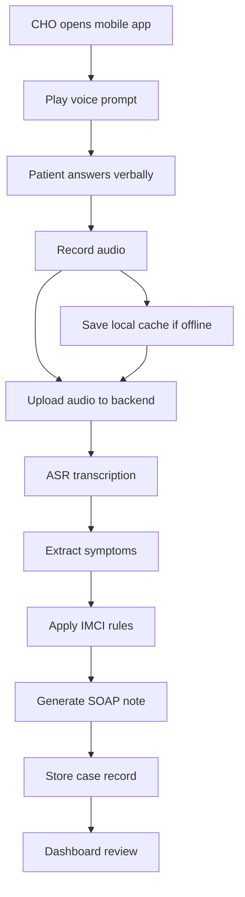

# IIMV System Architecture

## Overview

This project uses a single monorepo with three main workspaces:

- `mobile-app/` — React Native Expo mobile app for CHOs
- `backend-api/` — FastAPI backend for audio processing, triage rules, and data persistence
- `dashboard/` — React dashboard for pilot review and case monitoring

The architecture is designed for a rule-first IMCI triage workflow, with LLMs used only for extraction and SOAP note generation.

## Data flow

1. CHO opens the mobile app and begins a triage session.
2. The app plays Hindi and English voice prompts using `expo-speech`.
3. Patient responses are recorded with `expo-av`.
4. Audio is uploaded to the backend when connectivity is available.
5. The backend transcribes audio via Whisper or another ASR engine.
6. Structured symptoms are extracted from the transcript.
7. Rule-based IMCI logic determines escalation level.
8. An LLM generates a draft SOAP note for CHO review.
9. The case is stored in the backend database.
10. The dashboard fetches case records for review and monitoring.

## Key components

### Mobile app

- Voice prompt engine (`expo-speech`)
- Audio recording (`expo-av`)
- Local offline cache (`expo-sqlite`)
- Sync-on-connect workflow for pending cases
- Simple chatbot-style interaction flow

### Backend

- FastAPI REST API
- Audio upload endpoint
- Rule-first IMCI triage logic
- Structured symptom extraction
- Optional LLM note generation
- Local SQLite persistence for MVP

### Dashboard

- React + Vite
- Case listing and pilot review
- Connects to backend API

## Offline support

Minimum offline support includes:

- Local audio/case cache in the mobile app
- Device-side persistence of unsynced cases
- Manual sync button in the UI
- Placeholder logic to retry uploads when connectivity returns

## Workflow diagram

